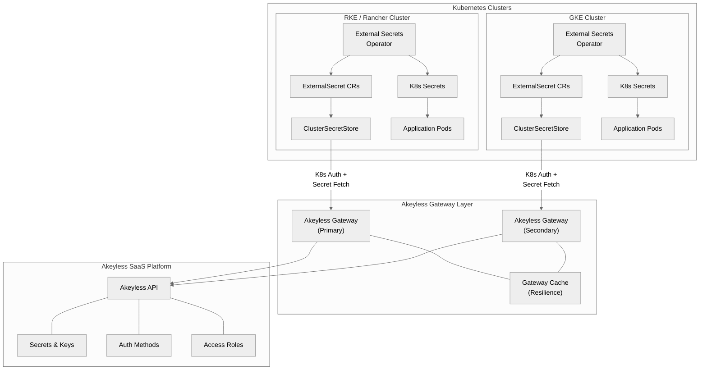

# Akeyless + Kubernetes External Secrets Operator (ESO) Runbook

An operator runbook for integrating Kubernetes clusters with [Akeyless](https://www.akeyless.io/) using the [External Secrets Operator (ESO)](https://external-secrets.io/). Covers both **RKE/Rancher** and **GKE** distributions, including migration paths from HashiCorp Vault.

This guide is designed for **platform engineers, DevOps teams, and SREs** who need to deliver secrets to Kubernetes workloads at scale using a standardized, auditable, and automated approach.

## Table of Contents

| # | Document | Description |
|---|---|---|
| 1 | [Architecture Overview](docs/01-architecture-overview.md) | High-level architecture, components, and data flow |
| 2 | [Prerequisites](docs/02-prerequisites.md) | Tools, access, and configuration needed before starting |
| 3 | [Cluster Setup -- RKE](docs/03-cluster-setup-rke.md) | RKE/Rancher-specific cluster preparation (includes Rancher-native approach) |
| 4 | [Cluster Setup -- GKE](docs/04-cluster-setup-gke.md) | GKE-specific cluster preparation |
| 5 | [Akeyless Auth Configuration](docs/05-akeyless-auth-config.md) | Creating Kubernetes auth methods in Akeyless (two-step process) |
| 6 | [ESO Deployment](docs/06-eso-deployment.md) | Installing and configuring ESO with Akeyless provider |
| 7 | [Secret Management](docs/07-secret-management.md) | ExternalSecret patterns, RBAC mapping, and best practices |
| 8 | [Pipeline Automation](docs/08-pipeline-automation.md) | CI/CD integration and Terraform automation |
| 9 | [Migration from Vault](docs/09-migration-from-vault.md) | Phased migration from HashiCorp Vault to Akeyless |
| 10 | [Troubleshooting](docs/10-troubleshooting.md) | Common issues, debugging, and resolution steps |

| Resource | Description |
|---|---|
| [Terraform Modules](terraform/) | Reusable modules for automated K8s auth onboarding |
| [Kubernetes Manifests](manifests/) | Ready-to-apply YAML for SA, RBAC, SecretStore, ExternalSecrets |
| [Automation Scripts](scripts/) | Cluster param extraction and connectivity validation |
| [Validation Log](VALIDATION-LOG.md) | Full test results from live MicroK8s + Rancher validation |

## Architecture Overview

## Quick Start

1. Verify [prerequisites](docs/02-prerequisites.md) are met
2. Prepare your cluster: [RKE](docs/03-cluster-setup-rke.md) or [GKE](docs/04-cluster-setup-gke.md)
3. Configure [Akeyless K8s auth](docs/05-akeyless-auth-config.md)
4. Deploy [ESO with Akeyless provider](docs/06-eso-deployment.md)
5. Create your first [ExternalSecret](docs/07-secret-management.md)

For automated onboarding, jump to [Pipeline Automation](docs/08-pipeline-automation.md).

## Prerequisites Summary

- Akeyless account with admin access (or scoped role for auth method creation)
- Akeyless Gateway deployed and reachable from your clusters
- `kubectl` access to target clusters with `cluster-admin` privileges
- Helm v3.x installed locally or in CI
- Terraform >= 1.3 (for automation tracks)
- `akeyless` CLI installed locally

## Additional Resources

- [Akeyless Documentation](https://docs.akeyless.io)
- [External Secrets Operator Documentation](https://external-secrets.io/)
- [Akeyless Terraform Provider](https://registry.terraform.io/providers/akeyless-community/akeyless/latest/docs)
- [Akeyless Helm Charts](https://github.com/akeylesslabs/helm-charts)

## License

This project is licensed under the Apache License 2.0 -- see [LICENSE](LICENSE) for details.
