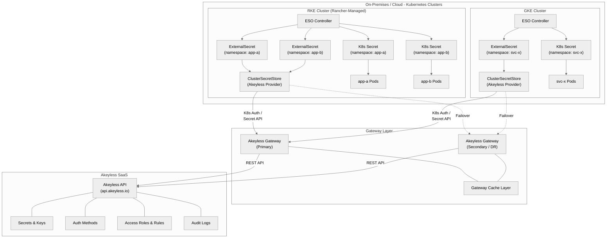

# Architecture Overview

This document describes the high-level architecture for integrating Kubernetes clusters with Akeyless using the External Secrets Operator (ESO).

## Components

| Component | Role |
|---|---|
| **Akeyless SaaS Platform** | Central secrets management -- stores secrets, manages access roles, handles encryption |
| **Akeyless Gateway** | On-premises or cloud-hosted proxy that handles authentication, caching, and API proxying between clusters and the Akeyless SaaS backend |
| **External Secrets Operator (ESO)** | Kubernetes operator that syncs secrets from external providers (Akeyless) into native K8s `Secret` objects |
| **ClusterSecretStore** | Cluster-scoped ESO resource that defines how to connect and authenticate to Akeyless |
| **ExternalSecret** | Namespace-scoped ESO resource that declares which secrets to fetch and how to map them into K8s Secrets |
| **K8s Auth Method** | Akeyless authentication method that validates Kubernetes ServiceAccount tokens via the TokenReview API |

## High-Level Architecture



## Data Flow Summary

1. **ExternalSecret** resources are applied to the cluster (manually or via GitOps).
2. The **ESO Controller** watches for ExternalSecret CRs and resolves the referenced **ClusterSecretStore**.
3. ESO authenticates to the **Akeyless Gateway** using the Kubernetes auth method (ServiceAccount token).
4. The Gateway validates the token against the cluster's **TokenReview API** and returns an Akeyless access token.
5. ESO uses the access token to fetch the requested secret values from the Gateway.
6. The Gateway serves secrets from its **cache** (if cached and still valid) or fetches from the **Akeyless SaaS** backend.
7. ESO creates or updates the corresponding **Kubernetes Secret** in the target namespace.
8. Pods consume the K8s Secret via volume mounts or environment variables -- no application changes required.
9. ESO re-syncs on the configured **refreshInterval** (e.g., every 5 minutes), keeping secrets current without pod restarts.

## Gateway Caching and Resilience

The Akeyless Gateway provides a caching layer that serves two purposes:

- **Performance**: Frequently accessed secrets are served from local cache, reducing latency and API calls to the SaaS backend.
- **Resilience**: If the SaaS backend is temporarily unreachable, cached secrets continue to be served for the duration of their TTL.

> **Best Practice:** Deploy at least two Akeyless Gateways behind a load balancer for high availability. Configure ESO's `ClusterSecretStore` with multiple gateway URLs for automatic failover.

## Multi-Cluster Strategy

For organizations running multiple Kubernetes clusters across different distributions and environments:

| Concern | Recommendation |
|---|---|
| **Gateway placement** | Deploy gateways in the same network as the clusters they serve. Use a regional gateway per cluster group. |
| **Auth method per cluster** | Create one Kubernetes auth method per cluster in Akeyless. Name them consistently (e.g., `k8s-auth-<env>-<cluster-name>`). |
| **Secret path hierarchy** | Organize secrets by environment and application: `/production/app-a/db-password`, `/staging/app-b/api-key`. |
| **RBAC isolation** | Map Akeyless roles to K8s namespaces/service accounts. A role for `namespace=payments` should only access `/production/payments/*`. |
| **Automation** | Use Terraform modules to onboard new clusters. The module creates the auth method, roles, and access rules in a single apply. |

## Network Requirements

ESO in each cluster must be able to reach the Akeyless Gateway over HTTPS (port 8000 with `/api/v2` path, or the internal service on port 8080 for same-cluster deployments). The Gateway must be able to reach:

- The Kubernetes API server of each cluster (for TokenReview validation) on port 443.
- The Akeyless SaaS API (`api.akeyless.io`) on port 443.

```
K8s Cluster (ESO) --HTTPS:8000/api/v2--> Akeyless Gateway --HTTPS:443--> api.akeyless.io
                                         |
                                         +--HTTPS:443--> K8s API Server (TokenReview)
```

> **Warning:** If your clusters are behind a firewall or NAT, ensure the Gateway has a routable path to the K8s API server. For GKE private clusters, you may need to use authorized networks or a proxy.

## Next Steps

- [Prerequisites](02-prerequisites.md) -- verify you have everything needed before proceeding
- [Cluster Setup -- RKE](03-cluster-setup-rke.md) or [Cluster Setup -- GKE](04-cluster-setup-gke.md) -- prepare your cluster
