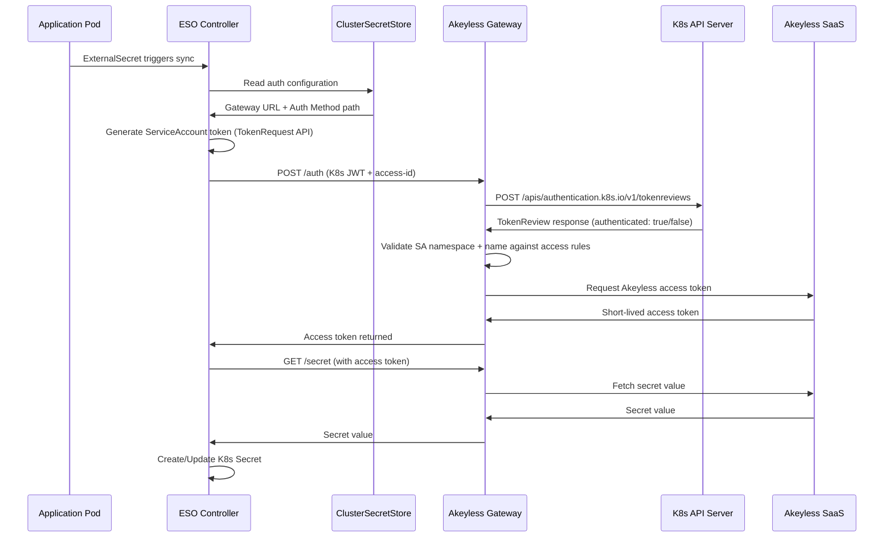

# Akeyless Auth Configuration

This document covers creating Kubernetes authentication methods in Akeyless so that ESO can authenticate from each cluster.

## How Kubernetes Auth Works in Akeyless

When ESO needs to fetch a secret, it presents a Kubernetes ServiceAccount token to the Akeyless Gateway. The Gateway validates that token by calling the Kubernetes TokenReview API on the source cluster. If the token is valid and the ServiceAccount matches the configured access rules, Akeyless issues a short-lived access token that ESO uses to fetch secrets.

### Authentication Sequence



## Step 1: Create the Kubernetes Auth Method via CLI

Kubernetes auth in Akeyless is a **two-step process**: first you create the auth method (which defines who can authenticate), then you create a gateway K8s auth config (which tells the gateway how to validate tokens against a specific cluster).

### Step 1a: Create the K8s Auth Method

```bash
CLUSTER_NAME="<REPLACE_ME>"

akeyless auth-method create k8s \
  --name "/k8s-auth/${CLUSTER_NAME}" \
  --bound-namespaces "external-secrets" \
  --bound-sa-names "external-secrets,external-secrets-cert-controller" \
  --json
```

**Expected output:**
```json
{
  "access_id": "p-xxxxxxxxxx",
  "prv_key": "LS0tLS1CRUdJTi..."
}
```

> **Important:** Save both `access_id` and `prv_key` from the output. The `prv_key` is a Base64-encoded RSA private key that was auto-generated (via `--gen-key`, which defaults to `true`). You will need both values in the next step.

```bash
# Save the values
ACCESS_ID="<access_id from output>"
PRV_KEY="<prv_key from output>"
```

### Step 1b: Configure Gateway K8s Auth

This step registers the cluster connection details with the Akeyless Gateway so it can validate incoming K8s tokens:

```bash
K8S_API_SERVER="<REPLACE_ME>"         # e.g., https://10.0.1.100:6443
TOKEN_REVIEWER_JWT="<REPLACE_ME>"     # JWT from the cluster setup step
K8S_CA_CERT_BASE64="<REPLACE_ME>"     # Base64-encoded CA cert (single line)
GATEWAY_URL="<REPLACE_ME>"            # External URL to reach gateway management API

akeyless gateway-create-k8s-auth-config \
  --name "${CLUSTER_NAME}-k8s-config" \
  --access-id "$ACCESS_ID" \
  --signing-key "$PRV_KEY" \
  --k8s-host "$K8S_API_SERVER" \
  --k8s-ca-cert "$K8S_CA_CERT_BASE64" \
  --token-reviewer-jwt "$TOKEN_REVIEWER_JWT" \
  --gateway-url "$GATEWAY_URL"
```

> **Note:** The `--k8s-issuer` flag is available if you need to specify a custom JWT issuer. In newer Akeyless versions, issuer validation is done by the API server and this parameter may not be required. If your cluster uses a non-standard JWT issuer, set `--k8s-issuer` to match, or add `--disable-issuer-validation true` to skip issuer checks entirely. Common issuers: `kubernetes/serviceaccount` (standard), `https://kubernetes.default.svc.cluster.local` (some managed distributions).

> **Warning:** The `--gateway-url` is the URL your local CLI uses to reach the gateway's management API (typically the ingress or external IP on port 8000). This is NOT the in-cluster service URL. The in-cluster URL is used later in the ClusterSecretStore configuration.

### Parameter Explanation (`gateway-create-k8s-auth-config`)

| Parameter | Description |
|---|---|
| `--name` | A name for this K8s auth config on the gateway. Referenced as `k8sConfName` in the ClusterSecretStore. |
| `--access-id` | The `access_id` returned from `auth-method create k8s` in Step 1a. |
| `--signing-key` | The `prv_key` returned from `auth-method create k8s` — Base64-encoded RSA private key auto-generated by Akeyless. |
| `--k8s-host` | The K8s API server URL that the Gateway will use for TokenReview calls. |
| `--k8s-ca-cert` | Base64-encoded CA certificate of the K8s API server (single line, no newlines). |
| `--token-reviewer-jwt` | The long-lived JWT of the token reviewer ServiceAccount (from cluster setup). |
| `--gateway-url` | External URL to reach the gateway's management API (e.g., `https://gateway.example.com:8000`). |
| `--k8s-issuer` | The expected JWT issuer claim. Set to match your cluster's issuer, or use `--disable-issuer-validation true` to skip. |

> **Tip:** If the Gateway is also accessible via `--use-gw-service-account`, you can skip providing `--k8s-host`, `--k8s-ca-cert`, and `--token-reviewer-jwt` — the Gateway will use its own service account for TokenReview calls. This only works when the Gateway runs inside the same cluster.

## Step 2: Create an Access Role

Create a role that defines what secrets this auth method can access:

```bash
akeyless create-role \
  --name "/k8s-roles/${CLUSTER_NAME}-eso-role"
```

**Expected output:**
```json
{
  "name": "/k8s-roles/prod-rke-us-east-eso-role"
}
```

## Step 3: Set Access Rules on the Role

Grant the role permission to read secrets under specific paths:

```bash
# Grant read access to a secret path subtree
akeyless set-role-rule \
  --role-name "/k8s-roles/${CLUSTER_NAME}-eso-role" \
  --path "/production/*" \
  --capability read \
  --capability list
```

**Expected output:**
```json
{
  "name": "/k8s-roles/prod-rke-us-east-eso-role",
  ...
}
```

> **Tip:** Use the principle of least privilege. Create separate roles for different environments and applications. A production cluster should not have access to staging secrets and vice versa.

### Common Access Patterns

| Pattern | Path Rule | Use Case |
|---|---|---|
| Environment-scoped | `/production/*` | All production secrets |
| Application-scoped | `/production/app-a/*` | Secrets for a specific application |
| Shared secrets | `/shared/certificates/*` | Shared TLS certs across applications |
| Cross-environment | `/*/app-a/*` | Same app across all environments (use cautiously) |

## Step 4: Associate the Auth Method with the Role

```bash
akeyless assoc-role-am \
  --role-name "/k8s-roles/${CLUSTER_NAME}-eso-role" \
  --am-name "/k8s-auth/${CLUSTER_NAME}"
```

**Expected output:**
```json
{
  "name": "/k8s-roles/prod-rke-us-east-eso-role",
  ...
}
```

## Step 5: Restrict by Namespace and ServiceAccount (Optional but Recommended)

You can further restrict the association so that only specific K8s namespaces and ServiceAccounts can use this role:

```bash
akeyless assoc-role-am \
  --role-name "/k8s-roles/${CLUSTER_NAME}-eso-role" \
  --am-name "/k8s-auth/${CLUSTER_NAME}" \
  --sub-claims "namespace=external-secrets,pod_name=external-secrets-*"
```

This ensures that even if someone obtains a valid K8s token, they can only access secrets if they match the sub-claim constraints.

## Step 6: Verify the Auth Method

Test authentication from a machine that can reach the Gateway:

```bash
# Create a short-lived token for testing
TEST_TOKEN=$(kubectl create token external-secrets \
  -n external-secrets \
  --duration=600s 2>/dev/null || echo "ESO not yet installed - skip this test")

if [ "$TEST_TOKEN" != "ESO not yet installed - skip this test" ]; then
  akeyless auth \
    --access-id "<AUTH_METHOD_ACCESS_ID>" \
    --access-type k8s \
    --k8s-auth-config-name "${CLUSTER_NAME}-k8s-config" \
    --gateway-url "$GATEWAY_URL" \
    --k8s-service-account-token "$TEST_TOKEN"
fi
```

> **Note:** The `--k8s-auth-config-name` must match the `--name` you used in Step 1b (`gateway-create-k8s-auth-config`), not the auth method path. This test only works after ESO is installed (since it creates a token for the ESO ServiceAccount). You can also verify via the Akeyless Console under **Auth Methods > /k8s-auth/<cluster-name>**.

## Multiple Clusters: Naming Convention

When onboarding multiple clusters, use a consistent naming convention:

```
Auth Methods:
  /k8s-auth/prod-rke-us-east
  /k8s-auth/prod-gke-us-central
  /k8s-auth/staging-rke-us-east
  /k8s-auth/dev-gke-us-central

Roles:
  /k8s-roles/prod-rke-us-east-eso-role
  /k8s-roles/prod-gke-us-central-eso-role
  /k8s-roles/staging-rke-us-east-eso-role
  /k8s-roles/dev-gke-us-central-eso-role
```

This makes it easy to audit, search, and automate.

## Automating with Terraform

For automated onboarding, see the [Terraform module](../terraform/modules/akeyless-k8s-auth/) and [Pipeline Automation](08-pipeline-automation.md) guide. The Terraform module encapsulates Steps 1-4 above into a single `terraform apply`.

## Next Steps

- [ESO Deployment](06-eso-deployment.md) -- install and configure ESO with the Akeyless provider
