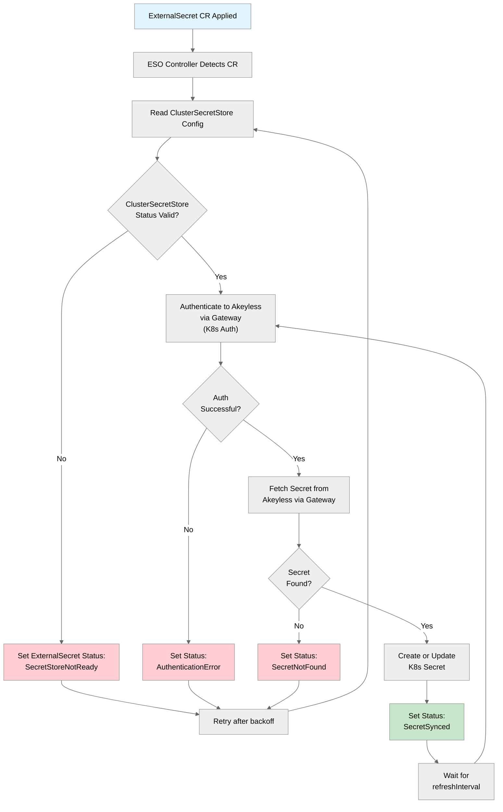

# ESO Deployment

This document covers installing the External Secrets Operator and configuring it to use Akeyless as the secrets provider.

## Step 1: Install ESO via Helm

```bash
helm repo add external-secrets https://charts.external-secrets.io
helm repo update
```

Install ESO into the `external-secrets` namespace:

```bash
helm install external-secrets external-secrets/external-secrets \
  --namespace external-secrets \
  --create-namespace \
  --set installCRDs=true \
  --set webhook.port=9443 \
  --set certController.enabled=true \
  --version <LATEST_STABLE_VERSION>
```

**Expected output:**
```
NAME: external-secrets
LAST DEPLOYED: ...
NAMESPACE: external-secrets
STATUS: deployed
```

Verify all pods are running:

```bash
kubectl get pods -n external-secrets
```

**Expected output:**
```
NAME                                                READY   STATUS    RESTARTS   AGE
external-secrets-xxxxxxxxx-xxxxx                    1/1     Running   0          60s
external-secrets-cert-controller-xxxxxxxxx-xxxxx    1/1     Running   0          60s
external-secrets-webhook-xxxxxxxxx-xxxxx            1/1     Running   0          60s
```

> **Tip:** For production deployments, pin the chart version and image tags. Use `--version` to lock the Helm chart and `--set image.tag=vX.Y.Z` to lock the container image. Check the latest stable version with:
> ```bash
> helm search repo external-secrets/external-secrets --versions | head -5
> ```

### Helm Values for Production

For production environments, consider these additional Helm values:

```yaml
# values-production.yaml
replicaCount: 2

resources:
  requests:
    cpu: 100m
    memory: 128Mi
  limits:
    cpu: 500m
    memory: 512Mi

serviceMonitor:
  enabled: true  # If you use Prometheus Operator

webhook:
  replicaCount: 2

certController:
  replicaCount: 2

# Increase log verbosity for initial setup, reduce later
log:
  level: info
  timeEncoding: iso8601
```

Install with custom values:

```bash
helm install external-secrets external-secrets/external-secrets \
  --namespace external-secrets \
  --create-namespace \
  --set installCRDs=true \
  -f values-production.yaml \
  --version <LATEST_STABLE_VERSION>
```

## Step 2: Create the ClusterSecretStore

The `ClusterSecretStore` tells ESO how to connect and authenticate to Akeyless. It is cluster-scoped, so it can be referenced by `ExternalSecret` resources in any namespace.

```bash
kubectl apply -f - <<'EOF'
apiVersion: external-secrets.io/v1
kind: ClusterSecretStore
metadata:
  name: akeyless
  labels:
    app.kubernetes.io/part-of: akeyless-integration
spec:
  provider:
    akeyless:
      # Same cluster (recommended) — use the gateway's internal service:
      akeylessGWApiURL: "http://<RELEASE_NAME>-akeyless-gateway-internal.<GATEWAY_NAMESPACE>.svc:8080"
      # Different cluster — use the gateway's external URL (ingress/load balancer):
      # akeylessGWApiURL: "https://<GATEWAY_EXTERNAL_URL>:8000/api/v2"
      authSecretRef:
        kubernetesAuth:
          accessID: "<AUTH_METHOD_ACCESS_ID>"
          k8sConfName: "<CLUSTER_NAME>-k8s-config"
          serviceAccountRef:
            name: "external-secrets"
            namespace: "external-secrets"
EOF
```

> **Important:** ESO must reach the gateway's V2 API on a port that serves the `/kubernetes/auth` endpoint. For same-cluster deployments, the gateway's internal service on port 8080 provides the most reliable connectivity. For cross-cluster or external access, use the gateway URL on port 8000 with the `/api/v2` path.

> **Note:** The `k8sConfName` is the name given to the `gateway-create-k8s-auth-config` configuration, not the auth method path.

> Replace `<RELEASE_NAME>`, `<GATEWAY_NAMESPACE>`, `<AUTH_METHOD_ACCESS_ID>`, and `<CLUSTER_NAME>` with your actual values.

**Expected output:**
```
clustersecretstore.external-secrets.io/akeyless created
```

### Verify the ClusterSecretStore

```bash
kubectl get clustersecretstore akeyless
```

**Expected output:**
```
NAME       AGE   STATUS   CAPABILITIES   READY
akeyless   10s   Valid    ReadWrite      True
```

If the status is not `Valid`, check the conditions:

```bash
kubectl describe clustersecretstore akeyless
```

Look at the `Status.Conditions` section for error details.

## Secret Sync Lifecycle

Once the ClusterSecretStore is healthy, the ESO reconciliation loop begins for each `ExternalSecret`:



### Key Behaviors

| Behavior | Description |
|---|---|
| **Refresh interval** | ESO re-fetches the secret on every `refreshInterval` (default varies; set it explicitly). |
| **Ownership** | The K8s Secret is owned by the ExternalSecret CR. Deleting the ExternalSecret deletes the K8s Secret (unless `deletionPolicy: Retain` is set). |
| **Immutable secrets** | Set `spec.target.immutable: true` to create immutable K8s Secrets (cannot be modified by users). |
| **Status tracking** | Each ExternalSecret has `.status.conditions` and `.status.syncedResourceVersion` for observability. |

## Step 3: Create a Test ExternalSecret

Verify the integration by fetching a test secret:

First, create a test secret in Akeyless (if one does not exist):

```bash
akeyless create-secret \
  --name "/test/eso-integration-test" \
  --value "hello-from-akeyless"
```

Then create the ExternalSecret:

```bash
kubectl apply -f - <<'EOF'
apiVersion: external-secrets.io/v1
kind: ExternalSecret
metadata:
  name: test-akeyless-secret
  namespace: default
spec:
  refreshInterval: 5m
  secretStoreRef:
    name: akeyless
    kind: ClusterSecretStore
  target:
    name: test-akeyless-secret
    creationPolicy: Owner
  data:
    - secretKey: my-secret
      remoteRef:
        key: /test/eso-integration-test
EOF
```

**Expected output:**
```
externalsecret.external-secrets.io/test-akeyless-secret created
```

Verify the sync:

```bash
kubectl get externalsecret test-akeyless-secret -n default
```

**Expected output:**
```
NAME                   STORE      REFRESH INTERVAL   STATUS         READY
test-akeyless-secret   akeyless   5m                 SecretSynced   True
```

Verify the K8s Secret was created:

```bash
kubectl get secret test-akeyless-secret -n default -o jsonpath='{.data.my-secret}' | base64 -d
```

**Expected output:**
```
hello-from-akeyless
```

## Step 4: Clean Up Test Resources

```bash
kubectl delete externalsecret test-akeyless-secret -n default
akeyless delete-item --name "/test/eso-integration-test"
```

## ESO Configuration Reference

### ClusterSecretStore vs SecretStore

| Type | Scope | Use Case |
|---|---|---|
| `ClusterSecretStore` | Cluster-wide | Shared Akeyless connection for all namespaces (recommended for most deployments) |
| `SecretStore` | Namespace-scoped | Per-namespace Akeyless connection with different auth methods or access levels |

For most deployments, a single `ClusterSecretStore` per cluster is sufficient. Use namespace-scoped `SecretStore` only when different namespaces need different Akeyless auth methods or access roles.

### Multiple Gateways (High Availability)

ESO does not natively support multiple gateway URLs in a single `ClusterSecretStore`. To achieve HA:

1. Place your Akeyless Gateways behind a load balancer and use the load balancer URL.
2. Alternatively, create two `ClusterSecretStore` resources and use `spec.secretStoreRef` in each `ExternalSecret` to pick one.

### ESO Metrics

ESO exposes Prometheus metrics on port 8080 by default:

| Metric | Description |
|---|---|
| `externalsecret_sync_calls_total` | Total sync attempts |
| `externalsecret_sync_calls_error` | Failed sync attempts |
| `externalsecret_status_condition` | Current condition of each ExternalSecret |

## Next Steps

- [Secret Management](07-secret-management.md) -- patterns for ExternalSecrets, RBAC mapping, and advanced configurations
