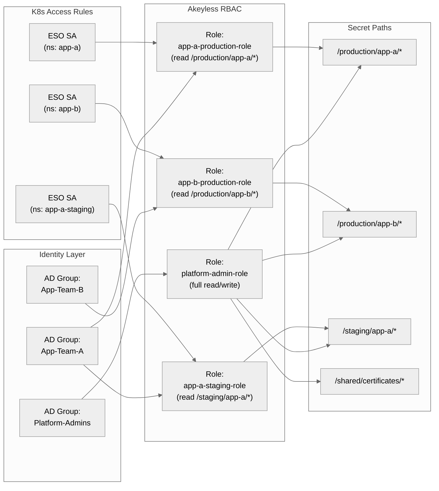

# Secret Management

This document covers patterns for creating ExternalSecrets, RBAC mapping strategies, and best practices for managing secrets at scale.

## ExternalSecret Patterns

### Static Secrets

Static secrets are the most common type -- API keys, database passwords, configuration values:

```yaml
apiVersion: external-secrets.io/v1
kind: ExternalSecret
metadata:
  name: app-database-credentials
  namespace: my-app
spec:
  refreshInterval: 5m
  secretStoreRef:
    name: akeyless
    kind: ClusterSecretStore
  target:
    name: app-database-credentials
    creationPolicy: Owner
    deletionPolicy: Retain
  data:
    - secretKey: username
      remoteRef:
        key: /production/my-app/db-username
    - secretKey: password
      remoteRef:
        key: /production/my-app/db-password
    - secretKey: connection-string
      remoteRef:
        key: /production/my-app/db-connection-string
```

> **Tip:** When an Akeyless item contains multiple fields you want mirrored to individual Secret keys, `dataFrom: extract:` is usually preferable to listing each `data:` entry — it flattens the item's JSON into Secret keys automatically and is ready to consume via `envFrom`.

### Dynamic Secrets

Dynamic secrets are generated on-demand by Akeyless (e.g., temporary database credentials):

```yaml
apiVersion: external-secrets.io/v1
kind: ExternalSecret
metadata:
  name: app-dynamic-db-creds
  namespace: my-app
spec:
  refreshInterval: 30m
  secretStoreRef:
    name: akeyless
    kind: ClusterSecretStore
  target:
    name: app-dynamic-db-creds
    creationPolicy: Owner
  dataFrom:
    - extract:
        key: /dynamic-secrets/production/my-app-postgres
```

> **Note:** Use `dataFrom: extract:` (not `data:`) when the dynamic secret returns multi-key JSON. This flattens the JSON into individual Secret keys (e.g., `id`, `password`, `user`, `ttl_in_minutes`), ready to consume via `envFrom`.

> **Warning:** Set `refreshInterval` shorter than the dynamic secret's TTL to ensure credentials are rotated before expiry. For example, if the dynamic secret TTL is 1 hour, set `refreshInterval: 30m`.

### Rotated Secrets

Rotated secrets are managed by Akeyless' automatic rotation:

```yaml
apiVersion: external-secrets.io/v1
kind: ExternalSecret
metadata:
  name: app-rotated-db-creds
  namespace: my-app
spec:
  refreshInterval: 5m
  secretStoreRef:
    name: akeyless
    kind: ClusterSecretStore
  target:
    name: app-rotated-db-creds
    creationPolicy: Owner
  dataFrom:
    - extract:
        key: /rotated-secrets/production/my-app-postgres
```

### Templated Secrets

Use templates to format secret values into configuration files:

```yaml
apiVersion: external-secrets.io/v1
kind: ExternalSecret
metadata:
  name: app-config
  namespace: my-app
spec:
  refreshInterval: 5m
  secretStoreRef:
    name: akeyless
    kind: ClusterSecretStore
  target:
    name: app-config
    creationPolicy: Owner
    template:
      engineVersion: v2
      data:
        config.yaml: |
          database:
            host: "{{ .db_host }}"
            port: {{ .db_port }}
            username: "{{ .db_username }}"
            password: "{{ .db_password }}"
          api:
            key: "{{ .api_key }}"
  data:
    - secretKey: db_host
      remoteRef:
        key: /production/my-app/db-host
    - secretKey: db_port
      remoteRef:
        key: /production/my-app/db-port
    - secretKey: db_username
      remoteRef:
        key: /production/my-app/db-username
    - secretKey: db_password
      remoteRef:
        key: /production/my-app/db-password
    - secretKey: api_key
      remoteRef:
        key: /production/my-app/api-key
```

### TLS Certificates

For TLS certificates stored in Akeyless:

```yaml
apiVersion: external-secrets.io/v1
kind: ExternalSecret
metadata:
  name: app-tls-cert
  namespace: my-app
spec:
  refreshInterval: 1h
  secretStoreRef:
    name: akeyless
    kind: ClusterSecretStore
  target:
    name: app-tls-cert
    creationPolicy: Owner
    template:
      type: kubernetes.io/tls
      data:
        tls.crt: "{{ .certificate_pem }}"
        tls.key: "{{ .private_key_pem }}"
  data:
    - secretKey: certificate_pem
      remoteRef:
        key: /certificates/production/my-app-tls-cert
        property: certificate_pem
    - secretKey: private_key_pem
      remoteRef:
        key: /certificates/production/my-app-tls-cert
        property: private_key_pem
```

> **Note:** Akeyless CERTIFICATE items contain both the certificate and private key in a single item with fields `certificate_pem` and `private_key_pem`. Use `property:` to extract each field, then the template assembles them into the standard `kubernetes.io/tls` Secret format.

## RBAC Mapping Model

A well-structured RBAC model maps organizational identity (AD groups, teams) to Akeyless access roles, which in turn control what K8s workloads can access.



### RBAC Strategy: One Role per Application per Environment

The recommended pattern is:

1. **One Akeyless auth method per cluster** (created during cluster onboarding).
2. **One Akeyless role per application per environment** (e.g., `app-a-production-role`).
3. **Sub-claims** on the role-auth-method association to restrict by K8s namespace and ServiceAccount.

```bash
# Create the role
akeyless create-role --name "/k8s-roles/app-a-production-role"

# Grant read access to the application's secret path
akeyless set-role-rule \
  --role-name "/k8s-roles/app-a-production-role" \
  --path "/production/app-a/*" \
  --capability read \
  --capability list
```

### Sub-claims for Per-Namespace Access Control

Sub-claims restrict a role based on claims in the JWT presented to Akeyless. **Critically, the JWT sent to Akeyless comes from the ServiceAccount referenced in the `SecretStore`/`ClusterSecretStore`, NOT from the ExternalSecret's namespace.**

#### What does NOT work

```yaml
# ClusterSecretStore using the shared ESO controller SA
spec:
  provider:
    akeyless:
      authSecretRef:
        kubernetesAuth:
          serviceAccountRef:
            name: external-secrets
            namespace: external-secrets
```

With this setup, ALL ExternalSecrets — regardless of their namespace — present the SAME JWT (from `external-secrets/external-secrets`). A sub-claim like `namespace=app-a` will NEVER match because the JWT's namespace is always `external-secrets`.

#### What DOES work: per-namespace SecretStore with per-namespace SA

To achieve per-namespace isolation via sub-claims, you must:

1. Create a ServiceAccount in each target namespace:

   ```yaml
   apiVersion: v1
   kind: ServiceAccount
   metadata:
     name: app-a-eso-sa
     namespace: app-a
   ```

2. Create a namespace-scoped `SecretStore` that references that SA:

   ```yaml
   apiVersion: external-secrets.io/v1
   kind: SecretStore
   metadata:
     name: akeyless-app-a
     namespace: app-a
   spec:
     provider:
       akeyless:
         akeylessGWApiURL: "https://<GATEWAY_URL>:8000/api/v2"
         authSecretRef:
           kubernetesAuth:
             accessID: "<AUTH_METHOD_ACCESS_ID>"
             k8sConfName: "<CLUSTER_NAME>-k8s-config"
             serviceAccountRef:
               name: app-a-eso-sa
   ```

3. Set sub-claims on the role-auth association to match that SA:

   ```bash
   akeyless assoc-role-am \
     --role-name "/k8s-roles/app-a-production-role" \
     --am-name "/k8s-auth/<CLUSTER_NAME>" \
     --sub-claims "namespace=app-a,service_account_name=app-a-eso-sa"
   ```

Now only ExternalSecrets in namespace `app-a` — using the `akeyless-app-a` SecretStore — can authenticate with this role. A ClusterSecretStore using the shared controller SA cannot.

> **Important:** For namespace-scoped `SecretStore`, the `serviceAccountRef.namespace` must match the SecretStore's own namespace (or be omitted, in which case it defaults to the SecretStore's namespace). You cannot reference a ServiceAccount in a different namespace from a namespace-scoped SecretStore — admission will reject it with: `"namespace should either be empty or match the namespace of the SecretStore."` Create a dedicated ServiceAccount in the target namespace.

## Secret Path Organization

### Recommended Hierarchy

```
/
├── production/
│   ├── app-a/
│   │   ├── db-password
│   │   ├── db-username
│   │   └── api-key
│   ├── app-b/
│   │   ├── db-password
│   │   └── redis-url
│   └── shared/
│       ├── tls-cert
│       └── tls-key
├── staging/
│   ├── app-a/
│   │   ├── db-password
│   │   └── api-key
│   └── app-b/
│       └── db-password
├── dynamic-secrets/
│   ├── production/
│   │   └── app-a-postgres
│   └── staging/
│       └── app-a-postgres
└── rotated-secrets/
    └── production/
        └── third-party-api-key
```

### Naming Conventions

| Element | Convention | Example |
|---|---|---|
| Secret path | `/<env>/<app>/<secret-name>` | `/production/payments/db-password` |
| Auth method | `/k8s-auth/<cluster-name>` | `/k8s-auth/prod-gke-us-central` |
| Role | `/k8s-roles/<app>-<env>-role` | `/k8s-roles/payments-production-role` |
| ExternalSecret name | `<app>-<purpose>` | `payments-db-credentials` |
| K8s Secret name | Match ExternalSecret name | `payments-db-credentials` |

## Best Practices

### Refresh Intervals

| Secret Type | Recommended Interval | Rationale |
|---|---|---|
| Static secrets | 5m - 15m | Balance between freshness and API load |
| Dynamic secrets | TTL / 2 | Ensure rotation before expiry |
| Rotated secrets | 5m | Pick up rotations quickly |
| Certificates | 1h | Certificates change infrequently |

### Deletion Policies

| Policy | Behavior | Use Case |
|---|---|---|
| `Owner` (default) | K8s Secret is deleted when ExternalSecret is deleted | Most applications |
| `Retain` | K8s Secret persists after ExternalSecret deletion | Safety-critical applications, avoid accidental deletion |
| `Merge` | ESO merges data into an existing Secret | Adding keys to a Secret managed by another controller |

> **Critical gotcha:** `deletionPolicy: Retain` does NOT override Kubernetes garbage collection. If you also use `creationPolicy: Owner` (the default), the resulting K8s Secret has an `ownerReference` to the ExternalSecret — so when the ExternalSecret is deleted, the Secret is garbage-collected regardless of `deletionPolicy`. To truly retain the Secret across ExternalSecret deletion, combine `deletionPolicy: Retain` with `creationPolicy: Orphan`.

> **Note:** `deletionPolicy: Merge` is designed to remove only the keys managed by this ExternalSecret on deletion. In practice, ESO may not clean up the keys when the ExternalSecret is deleted (it doesn't set a finalizer on Secrets without an owner reference). If you rely on Merge cleanup, test it explicitly in your ESO version.

### Labels and Annotations

Apply consistent labels to all ESO resources for discoverability:

```yaml
metadata:
  labels:
    app.kubernetes.io/managed-by: external-secrets
    app.kubernetes.io/part-of: akeyless-integration
    environment: production
    team: platform
```

## Next Steps

- [Pipeline Automation](08-pipeline-automation.md) -- automate ExternalSecret creation in CI/CD
- [Migration from Vault](09-migration-from-vault.md) -- migrate existing Vault-based secrets to Akeyless
