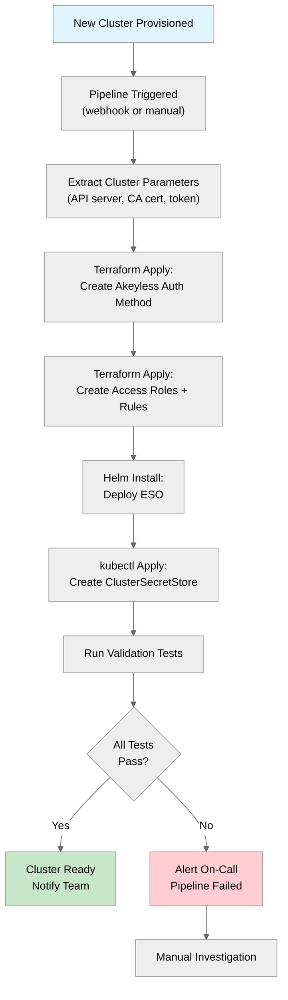

# Pipeline Automation

This document covers automating cluster onboarding, ESO deployment, and secret management through CI/CD pipelines and Terraform.

## Cluster Onboarding Pipeline

The goal is a fully automated pipeline: when a new Kubernetes cluster is provisioned, the pipeline configures Akeyless authentication, deploys ESO, and validates the integration -- with no manual steps.



## Step 1: Extract Cluster Parameters

Use the `scripts/extract-cluster-params.sh` script to gather the required parameters from a cluster:

```bash
./scripts/extract-cluster-params.sh
```

This outputs a JSON object with all the parameters needed for Terraform:

```json
{
  "cluster_name": "prod-rke-us-east",
  "k8s_api_server": "https://10.0.1.100:6443",
  "k8s_ca_cert_base64": "LS0tLS1CRUdJTi...",
  "token_reviewer_jwt": "eyJhbGciOiJSUz..."
}
```

In a CI/CD pipeline, capture this output as a variable:

```bash
CLUSTER_PARAMS=$(./scripts/extract-cluster-params.sh)
export TF_VAR_k8s_api_server=$(echo $CLUSTER_PARAMS | jq -r '.k8s_api_server')
export TF_VAR_k8s_ca_cert=$(echo $CLUSTER_PARAMS | jq -r '.k8s_ca_cert_base64')
export TF_VAR_token_reviewer_jwt=$(echo $CLUSTER_PARAMS | jq -r '.token_reviewer_jwt')
```

## Step 2: Terraform -- Create Akeyless Auth Method and Roles

Use the provided Terraform module to create the auth method, role, and access rules:

### Single Cluster

```hcl
# main.tf
module "akeyless_k8s_auth" {
  source = "../../modules/akeyless-k8s-auth"

  cluster_name         = "prod-rke-us-east"
  k8s_api_server       = var.k8s_api_server
  k8s_ca_cert          = var.k8s_ca_cert
  token_reviewer_jwt   = var.token_reviewer_jwt
  gateway_url          = "https://gateway.example.com:8000/api/v2"
  bound_namespaces     = ["external-secrets"]
  bound_sa_names       = ["external-secrets"]
  secret_access_paths  = ["/production/*"]
}
```

### Multi-Cluster

```hcl
# main.tf
locals {
  clusters = {
    "prod-rke-us-east" = {
      k8s_api_server      = "https://10.0.1.100:6443"
      k8s_ca_cert         = var.prod_rke_ca_cert
      token_reviewer_jwt  = var.prod_rke_jwt
      secret_paths        = ["/production/*"]
    }
    "prod-gke-us-central" = {
      k8s_api_server      = "https://35.202.100.50"
      k8s_ca_cert         = var.prod_gke_ca_cert
      token_reviewer_jwt  = var.prod_gke_jwt
      secret_paths        = ["/production/*"]
    }
    "staging-rke-us-east" = {
      k8s_api_server      = "https://10.0.2.100:6443"
      k8s_ca_cert         = var.staging_rke_ca_cert
      token_reviewer_jwt  = var.staging_rke_jwt
      secret_paths        = ["/staging/*"]
    }
  }
}

module "akeyless_k8s_auth" {
  source   = "../../modules/akeyless-k8s-auth"
  for_each = local.clusters

  cluster_name         = each.key
  k8s_api_server       = each.value.k8s_api_server
  k8s_ca_cert          = each.value.k8s_ca_cert
  token_reviewer_jwt   = each.value.token_reviewer_jwt
  gateway_url          = "https://gateway.example.com:8000/api/v2"
  bound_namespaces     = ["external-secrets"]
  bound_sa_names       = ["external-secrets"]
  secret_access_paths  = each.value.secret_paths
}
```

Run Terraform:

```bash
terraform init
terraform plan -out=tfplan
terraform apply tfplan
```

**Expected output:**
```
Apply complete! Resources: 3 added, 0 changed, 0 destroyed.

Outputs:

auth_method_access_id = "p-xxxxxxxxxx"
auth_method_path      = "/k8s-auth/prod-rke-us-east"
k8s_auth_config_name  = "prod-rke-us-east-k8s-config"
role_name             = "/k8s-roles/prod-rke-us-east-eso-role"
```

## Step 3: Deploy ESO via Helm in CI/CD

```bash
# Add the Helm repo (idempotent)
helm repo add external-secrets https://charts.external-secrets.io
helm repo update

# Install or upgrade ESO
helm upgrade --install external-secrets external-secrets/external-secrets \
  --namespace external-secrets \
  --create-namespace \
  --set installCRDs=true \
  --version 0.10.7 \
  --wait \
  --timeout 5m
```

The `--wait` flag ensures the pipeline does not proceed until all ESO pods are ready.

## Step 4: Create ClusterSecretStore via Pipeline

Use the Terraform output to populate the ClusterSecretStore:

```bash
AUTH_METHOD_ACCESS_ID=$(terraform output -raw auth_method_access_id)
K8S_AUTH_CONFIG_NAME=$(terraform output -raw k8s_auth_config_name)
GATEWAY_URL="https://gateway.example.com:8000/api/v2"

kubectl apply -f - <<EOF
apiVersion: external-secrets.io/v1
kind: ClusterSecretStore
metadata:
  name: akeyless
  labels:
    app.kubernetes.io/managed-by: pipeline
    app.kubernetes.io/part-of: akeyless-integration
spec:
  provider:
    akeyless:
      akeylessGWApiURL: "${GATEWAY_URL}"
      authSecretRef:
        kubernetesAuth:
          accessID: "${AUTH_METHOD_ACCESS_ID}"
          k8sConfName: "${K8S_AUTH_CONFIG_NAME}"
          serviceAccountRef:
            name: "external-secrets"
            namespace: "external-secrets"
EOF
```

## Step 5: Validate the Integration

Run the validation script:

```bash
./scripts/validate-connectivity.sh
```

Or manually:

```bash
# Check ClusterSecretStore is ready
CSS_STATUS=$(kubectl get clustersecretstore akeyless -o jsonpath='{.status.conditions[0].status}')
if [ "$CSS_STATUS" != "True" ]; then
  echo "FAIL: ClusterSecretStore is not ready"
  kubectl describe clustersecretstore akeyless
  exit 1
fi
echo "PASS: ClusterSecretStore is ready"

# Create a test ExternalSecret
kubectl apply -f - <<'EOF'
apiVersion: external-secrets.io/v1
kind: ExternalSecret
metadata:
  name: pipeline-validation-test
  namespace: default
spec:
  refreshInterval: 1m
  secretStoreRef:
    name: akeyless
    kind: ClusterSecretStore
  target:
    name: pipeline-validation-test
    creationPolicy: Owner
  data:
    - secretKey: test
      remoteRef:
        key: /test/pipeline-validation
EOF

# Wait for sync
sleep 15

# Check sync status
ES_STATUS=$(kubectl get externalsecret pipeline-validation-test -n default \
  -o jsonpath='{.status.conditions[?(@.type=="Ready")].status}')
if [ "$ES_STATUS" != "True" ]; then
  echo "FAIL: ExternalSecret did not sync"
  kubectl describe externalsecret pipeline-validation-test -n default
  exit 1
fi
echo "PASS: ExternalSecret synced successfully"

# Clean up
kubectl delete externalsecret pipeline-validation-test -n default
echo "Validation complete -- cluster is ready for ESO workloads"
```

## Example CI/CD Pipeline Definitions

### GitHub Actions

```yaml
name: Onboard K8s Cluster to Akeyless ESO

on:
  workflow_dispatch:
    inputs:
      cluster_name:
        description: 'Cluster name (e.g., prod-rke-us-east)'
        required: true
      kubeconfig_secret:
        description: 'Name of the GitHub secret containing the kubeconfig'
        required: true

jobs:
  onboard:
    runs-on: ubuntu-latest
    steps:
      - uses: actions/checkout@v4

      - name: Set up kubeconfig
        run: |
          mkdir -p ~/.kube
          echo "${{ secrets[github.event.inputs.kubeconfig_secret] }}" | base64 -d > ~/.kube/config

      - name: Create token reviewer resources
        run: |
          kubectl apply -f manifests/rke/token-reviewer-role.yaml
          kubectl apply -f manifests/rke/token-reviewer-user.yaml

      - name: Extract cluster parameters
        id: params
        run: |
          PARAMS=$(./scripts/extract-cluster-params.sh)
          echo "k8s_api_server=$(echo $PARAMS | jq -r '.k8s_api_server')" >> $GITHUB_OUTPUT
          echo "k8s_ca_cert=$(echo $PARAMS | jq -r '.k8s_ca_cert_base64')" >> $GITHUB_OUTPUT
          echo "token_reviewer_jwt=$(echo $PARAMS | jq -r '.token_reviewer_jwt')" >> $GITHUB_OUTPUT

      - name: Setup Terraform
        uses: hashicorp/setup-terraform@v3

      - name: Terraform Init & Apply
        working-directory: terraform/examples/single-cluster
        env:
          TF_VAR_cluster_name: ${{ github.event.inputs.cluster_name }}
          TF_VAR_k8s_api_server: ${{ steps.params.outputs.k8s_api_server }}
          TF_VAR_k8s_ca_cert: ${{ steps.params.outputs.k8s_ca_cert }}
          TF_VAR_token_reviewer_jwt: ${{ steps.params.outputs.token_reviewer_jwt }}
          AKEYLESS_ACCESS_ID: ${{ secrets.AKEYLESS_ACCESS_ID }}
          AKEYLESS_ACCESS_KEY: ${{ secrets.AKEYLESS_ACCESS_KEY }}
        run: |
          terraform init
          terraform apply -auto-approve

      - name: Install ESO
        run: |
          helm repo add external-secrets https://charts.external-secrets.io
          helm repo update
          helm upgrade --install external-secrets external-secrets/external-secrets \
            --namespace external-secrets \
            --create-namespace \
            --set installCRDs=true \
            --version 0.10.7 \
            --wait --timeout 5m

      - name: Create ClusterSecretStore
        working-directory: terraform/examples/single-cluster
        run: |
          ACCESS_ID=$(terraform output -raw auth_method_access_id)
          AUTH_PATH=$(terraform output -raw auth_method_path)
          kubectl apply -f - <<EOF
          apiVersion: external-secrets.io/v1
          kind: ClusterSecretStore
          metadata:
            name: akeyless
          spec:
            provider:
              akeyless:
                akeylessGWApiURL: "https://gateway.example.com:8000/api/v2"
                authSecretRef:
                  kubernetesAuth:
                    accessID: "${ACCESS_ID}"
                    k8sConfName: "${K8S_AUTH_CONFIG_NAME}"
                    serviceAccountRef:
                      name: "external-secrets"
                      namespace: "external-secrets"
          EOF

      - name: Validate integration
        run: ./scripts/validate-connectivity.sh
```

### GitLab CI

```yaml
stages:
  - prepare
  - provision
  - deploy
  - validate

variables:
  CLUSTER_NAME: ""
  GATEWAY_URL: "https://gateway.example.com:8000/api/v2"

extract-params:
  stage: prepare
  script:
    - kubectl apply -f manifests/rke/token-reviewer-role.yaml
    - kubectl apply -f manifests/rke/token-reviewer-user.yaml
    - ./scripts/extract-cluster-params.sh > cluster-params.json
  artifacts:
    paths:
      - cluster-params.json

terraform-apply:
  stage: provision
  image: hashicorp/terraform:1.6
  script:
    - cd terraform/examples/single-cluster
    - export TF_VAR_cluster_name=$CLUSTER_NAME
    - export TF_VAR_k8s_api_server=$(jq -r '.k8s_api_server' ../../../cluster-params.json)
    - export TF_VAR_k8s_ca_cert=$(jq -r '.k8s_ca_cert_base64' ../../../cluster-params.json)
    - export TF_VAR_token_reviewer_jwt=$(jq -r '.token_reviewer_jwt' ../../../cluster-params.json)
    - terraform init
    - terraform apply -auto-approve
    - terraform output -json > ../../../terraform-outputs.json
  artifacts:
    paths:
      - terraform-outputs.json

deploy-eso:
  stage: deploy
  script:
    - helm repo add external-secrets https://charts.external-secrets.io
    - helm repo update
    - helm upgrade --install external-secrets external-secrets/external-secrets
        --namespace external-secrets --create-namespace
        --set installCRDs=true --version 0.10.7 --wait --timeout 5m
    - |
      ACCESS_ID=$(jq -r '.auth_method_access_id.value' terraform-outputs.json)
      AUTH_PATH=$(jq -r '.auth_method_path.value' terraform-outputs.json)
      envsubst < manifests/eso/cluster-secret-store.yaml | kubectl apply -f -

validate:
  stage: validate
  script:
    - ./scripts/validate-connectivity.sh
```

## Terraform State Management

For multi-cluster deployments, use a remote backend to share Terraform state:

```hcl
terraform {
  backend "gcs" {
    bucket = "my-org-terraform-state"
    prefix = "akeyless-k8s-auth"
  }
}
```

Or use Akeyless itself to store Terraform state encryption keys, creating a self-referential trust anchor.

## Next Steps

- [Migration from Vault](09-migration-from-vault.md) -- phased migration from HashiCorp Vault
- [Troubleshooting](10-troubleshooting.md) -- debug common issues with the automated pipeline
