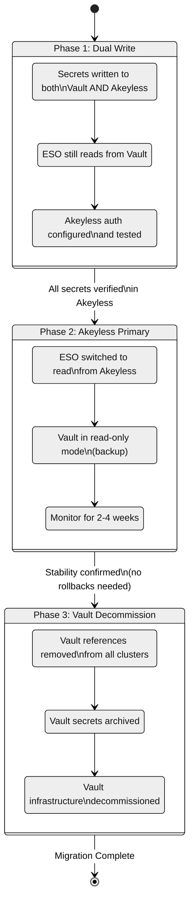

# Migration from HashiCorp Vault to Akeyless

This document provides a phased migration plan for organizations currently using HashiCorp Vault (with or without ESO) and transitioning to Akeyless as the primary secrets management platform.

## Migration Overview

The migration follows a three-phase approach that ensures zero downtime and allows rollback at each phase:



## Prerequisites

- [ ] Akeyless account provisioned and gateway deployed
- [ ] K8s auth methods created in Akeyless for all target clusters (see [Auth Configuration](05-akeyless-auth-config.md))
- [ ] ESO already installed in clusters (it works with both Vault and Akeyless providers)
- [ ] Inventory of all secrets currently stored in Vault
- [ ] Inventory of all applications consuming secrets via ESO + Vault

## Phase 1: Dual Write

In this phase, secrets exist in both Vault and Akeyless. ESO continues to read from Vault. This phase validates that Akeyless is correctly configured without any risk to running applications.

### Step 1.1: Inventory Existing Vault Secrets

List all secrets that ESO currently syncs from Vault:

```bash
# List all ExternalSecrets across all namespaces
kubectl get externalsecrets -A -o custom-columns=\
'NAMESPACE:.metadata.namespace,NAME:.metadata.name,STORE:.spec.secretStoreRef.name,STORE_KIND:.spec.secretStoreRef.kind,STATUS:.status.conditions[0].reason'
```

Export the secret paths:

```bash
kubectl get externalsecrets -A -o json | \
  jq -r '.items[] | .spec.data[]? | .remoteRef.key' | sort -u > vault-secret-paths.txt
```

### Step 1.2: Mirror Secrets to Akeyless

For each secret in Vault, create a corresponding secret in Akeyless. Use the Akeyless CLI or Terraform:

**Manual (per secret):**

```bash
# Read from Vault
VAULT_VALUE=$(vault kv get -field=value secret/production/my-app/db-password)

# Write to Akeyless
akeyless create-secret \
  --name "/production/my-app/db-password" \
  --value "$VAULT_VALUE"
```

**Automated (bulk migration script):**

```bash
#!/usr/bin/env bash
# migrate-secrets.sh -- Bulk copy secrets from Vault to Akeyless
set -euo pipefail

INPUT_FILE="${1:-vault-secret-paths.txt}"
VAULT_KV_MOUNT="${VAULT_KV_MOUNT:-secret}"

while IFS= read -r vault_path; do
  # Map Vault path to Akeyless path
  # Adjust this mapping to match your naming conventions
  akeyless_path="/${vault_path}"

  echo "Migrating: ${vault_path} -> ${akeyless_path}"

  # Read from Vault
  value=$(vault kv get -field=value "${VAULT_KV_MOUNT}/${vault_path}" 2>/dev/null) || {
    echo "  WARN: Could not read ${vault_path} from Vault, skipping"
    continue
  }

  # Check if it already exists in Akeyless
  existing=$(akeyless get-secret-value --name "${akeyless_path}" 2>/dev/null) || existing=""

  if [ -n "$existing" ]; then
    echo "  EXISTS: ${akeyless_path} already in Akeyless, updating"
    akeyless update-secret-val --name "${akeyless_path}" --value "$value"
  else
    echo "  CREATE: ${akeyless_path}"
    akeyless create-secret --name "${akeyless_path}" --value "$value"
  fi

done < "$INPUT_FILE"

echo "Migration complete. Review the output above for any warnings."
```

### Step 1.3: Set Up Dual-Write in CI/CD

Update your secret management pipeline to write to both systems:

```bash
# In your CI/CD pipeline or secret rotation scripts:
# Write to Vault (existing)
vault kv put secret/production/my-app/db-password value="$NEW_PASSWORD"

# Also write to Akeyless (new)
akeyless update-secret-val \
  --name "/production/my-app/db-password" \
  --value "$NEW_PASSWORD"
```

### Step 1.4: Validate Akeyless Secrets

Create a temporary `ClusterSecretStore` for Akeyless (alongside the existing Vault one):

```bash
kubectl apply -f - <<'EOF'
apiVersion: external-secrets.io/v1
kind: ClusterSecretStore
metadata:
  name: akeyless-validation
spec:
  provider:
    akeyless:
      akeylessGWApiURL: "https://<GATEWAY_URL>:8000/api/v2"
      authSecretRef:
        kubernetesAuth:
          accessID: "<AUTH_METHOD_ACCESS_ID>"
          k8sConfName: "<CLUSTER_NAME>-k8s-config"
          serviceAccountRef:
            name: "external-secrets"
            namespace: "external-secrets"
EOF
```

Create validation ExternalSecrets that read from Akeyless (do NOT replace the Vault ones yet):

```bash
kubectl apply -f - <<'EOF'
apiVersion: external-secrets.io/v1
kind: ExternalSecret
metadata:
  name: validation-db-password
  namespace: default
spec:
  refreshInterval: 5m
  secretStoreRef:
    name: akeyless-validation
    kind: ClusterSecretStore
  target:
    name: validation-db-password
    creationPolicy: Owner
  data:
    - secretKey: password
      remoteRef:
        key: /production/my-app/db-password
EOF
```

Compare the values:

```bash
# From Vault (existing)
VAULT_VAL=$(kubectl get secret my-app-db-password -n my-app -o jsonpath='{.data.password}' | base64 -d)

# From Akeyless (validation)
AK_VAL=$(kubectl get secret validation-db-password -n default -o jsonpath='{.data.password}' | base64 -d)

if [ "$VAULT_VAL" = "$AK_VAL" ]; then
  echo "MATCH: Values are identical"
else
  echo "MISMATCH: Values differ -- investigate before proceeding"
fi
```

### Phase 1 Completion Criteria

- [ ] All Vault secrets have been copied to Akeyless
- [ ] Dual-write is active in CI/CD pipelines
- [ ] Validation ExternalSecrets confirm matching values
- [ ] Akeyless ClusterSecretStore is healthy in all clusters

## Phase 2: Switch ESO to Akeyless

In this phase, you switch the existing ExternalSecrets from reading Vault to reading Akeyless. Vault becomes a read-only backup.

### Step 2.1: Update ExternalSecrets

For each ExternalSecret, change the `secretStoreRef` from Vault to Akeyless:

**Before (Vault):**

```yaml
spec:
  secretStoreRef:
    name: vault
    kind: ClusterSecretStore
```

**After (Akeyless):**

```yaml
spec:
  secretStoreRef:
    name: akeyless
    kind: ClusterSecretStore
```

> **Tip:** If you manage ExternalSecrets via GitOps (ArgoCD, Flux), update the manifests in Git and let the GitOps controller apply the changes. This gives you version-controlled rollback capability.

### Step 2.2: Rename the Akeyless ClusterSecretStore

To minimize changes to ExternalSecrets, you can rename the stores:

```bash
# Delete the validation store
kubectl delete clustersecretstore akeyless-validation

# Rename the Vault store (keep it as backup)
# Note: K8s does not support rename, so delete and recreate
kubectl get clustersecretstore vault -o yaml > vault-css-backup.yaml
kubectl delete clustersecretstore vault
kubectl apply -f - <<'EOF'
apiVersion: external-secrets.io/v1
kind: ClusterSecretStore
metadata:
  name: vault-backup
spec:
  # ... same Vault config ...
EOF

# Create the Akeyless store with the name "akeyless"
kubectl apply -f manifests/eso/cluster-secret-store.yaml
```

### Step 2.3: Monitor

Watch for sync errors after the switch:

```bash
# Check all ExternalSecrets across namespaces
kubectl get externalsecrets -A

# Look for any that are not Ready
kubectl get externalsecrets -A -o json | \
  jq -r '.items[] | select(.status.conditions[0].status != "True") | "\(.metadata.namespace)/\(.metadata.name): \(.status.conditions[0].message)"'
```

Set up alerts on ESO metrics:

```promql
# Alert if any ExternalSecret fails to sync for more than 15 minutes
increase(externalsecret_sync_calls_error[15m]) > 0
```

### Step 2.4: Put Vault in Read-Only Mode

Once all ExternalSecrets are successfully reading from Akeyless:

1. Remove write access from CI/CD pipelines to Vault
2. Revoke all Vault tokens except read-only ones used for backup
3. Keep Vault running for the monitoring period (2-4 weeks recommended)

### Phase 2 Completion Criteria

- [ ] All ExternalSecrets reference the Akeyless ClusterSecretStore
- [ ] All ExternalSecrets show `Ready: True` status
- [ ] No sync errors for at least 2 weeks
- [ ] CI/CD pipelines write only to Akeyless
- [ ] Vault is in read-only mode

## Phase 3: Vault Decommission

After the monitoring period confirms stability, decommission Vault.

### Step 3.1: Remove Vault Resources from Clusters

```bash
# Delete the backup Vault ClusterSecretStore
kubectl delete clustersecretstore vault-backup

# Delete Vault-specific SecretStores (if any)
kubectl get secretstores -A -o name | grep vault | xargs kubectl delete

# Remove Vault agent sidecars/injectors if still present
helm uninstall vault -n vault
```

### Step 3.2: Archive Vault Data

Before decommissioning, export Vault data for compliance:

```bash
# Export all secret paths (metadata only, not values)
vault kv list -format=json secret/ > vault-secret-inventory.json

# If required by compliance, export encrypted backup
vault operator raft snapshot save vault-final-backup.snap
```

### Step 3.3: Decommission Vault Infrastructure

1. Remove Vault Helm release from all clusters
2. Delete Vault PersistentVolumeClaims
3. Remove Vault-related DNS entries
4. Revoke all Vault root tokens and unseal keys
5. Delete Vault infrastructure (VMs, load balancers, storage)

### Phase 3 Completion Criteria

- [ ] No Vault references remain in any cluster
- [ ] Vault data archived per compliance requirements
- [ ] Vault infrastructure decommissioned
- [ ] Documentation updated to reference Akeyless only
- [ ] Runbooks updated to remove Vault procedures

## Rollback Procedures

### Rollback from Phase 2 to Phase 1

If issues arise after switching ESO to Akeyless:

```bash
# Switch ExternalSecrets back to Vault
# (update secretStoreRef back to the Vault store name)
kubectl apply -f <original-vault-externalsecrets>

# Re-enable Vault ClusterSecretStore
kubectl apply -f vault-css-backup.yaml

# Resume dual-write in CI/CD
```

### Rollback from Phase 1

Simply stop writing to Akeyless. No changes were made to the live secret delivery path.

## Migration Timeline Recommendations

| Phase | Duration | Key Activities |
|---|---|---|
| Phase 1 | 1-2 weeks | Secret mirroring, dual-write setup, validation |
| Phase 2 | 2-4 weeks | Switch + monitoring period |
| Phase 3 | 1 week | Cleanup and decommission |
| **Total** | **4-7 weeks** | |

> **Tip:** Run the migration per environment. Start with dev/staging, then production. Do not migrate all environments simultaneously.

## Next Steps

- [Troubleshooting](10-troubleshooting.md) -- debug issues that may arise during migration
